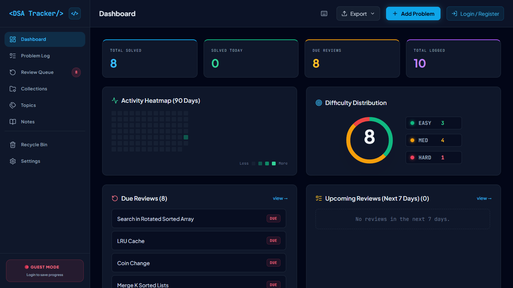
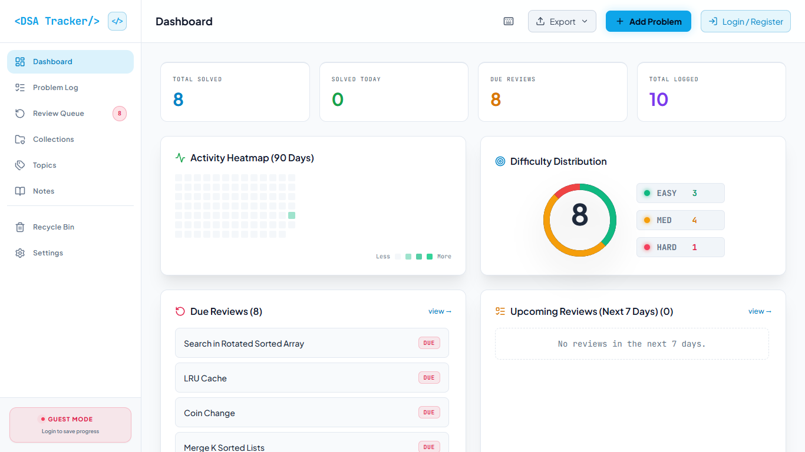
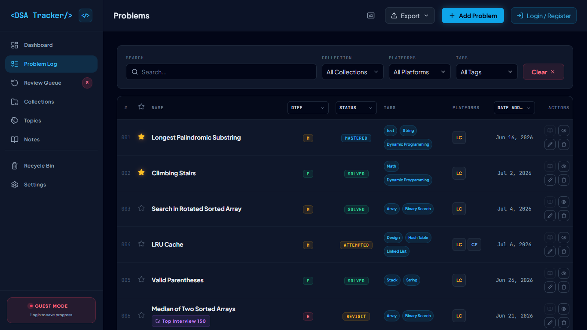
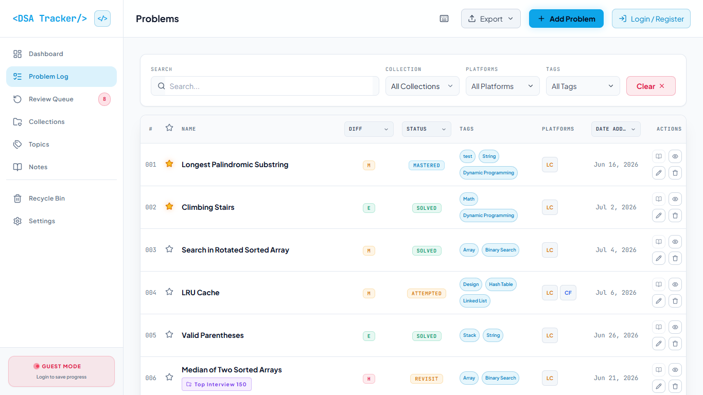
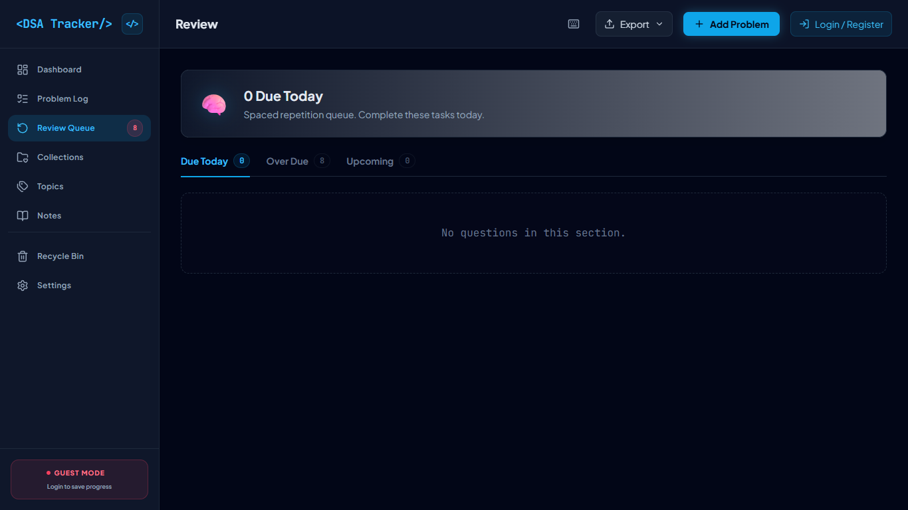
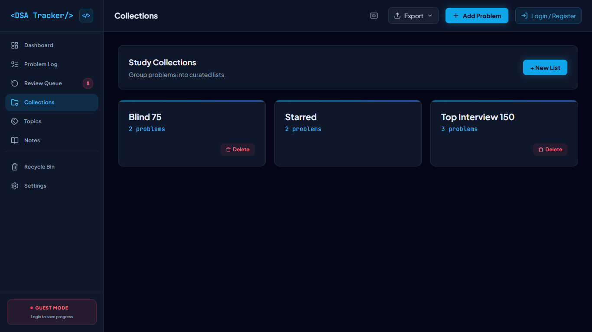
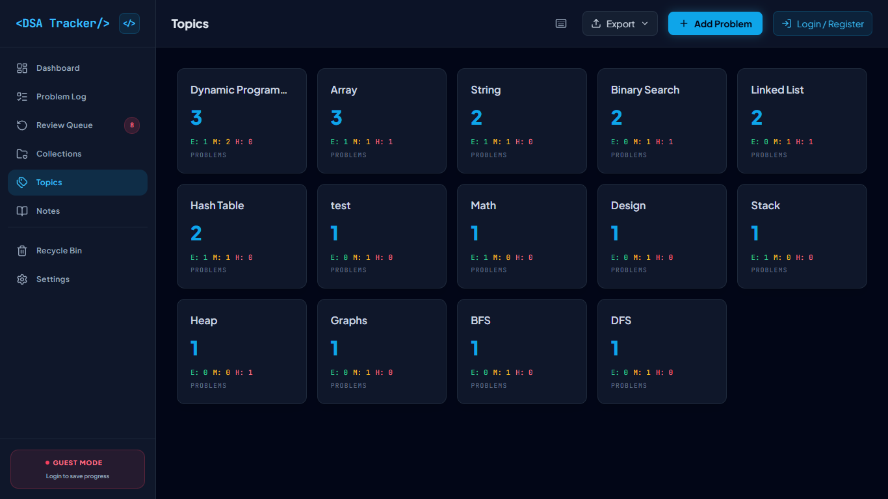
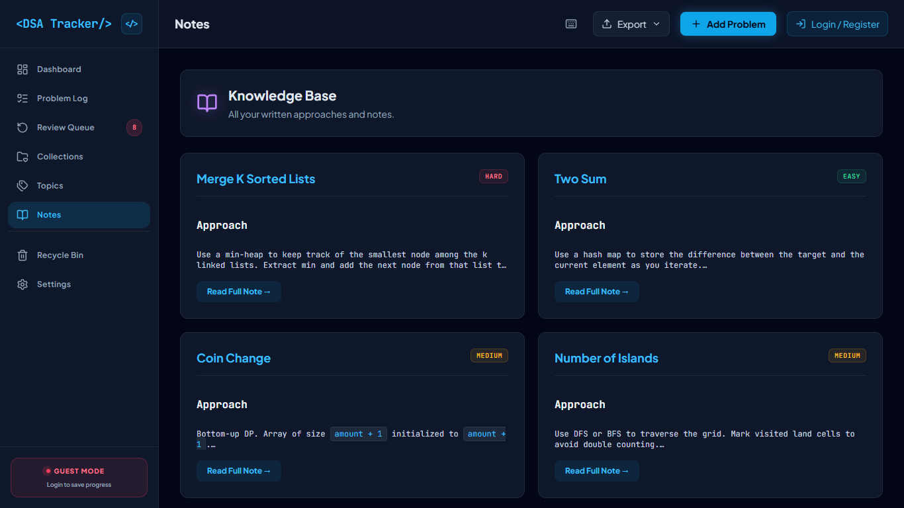
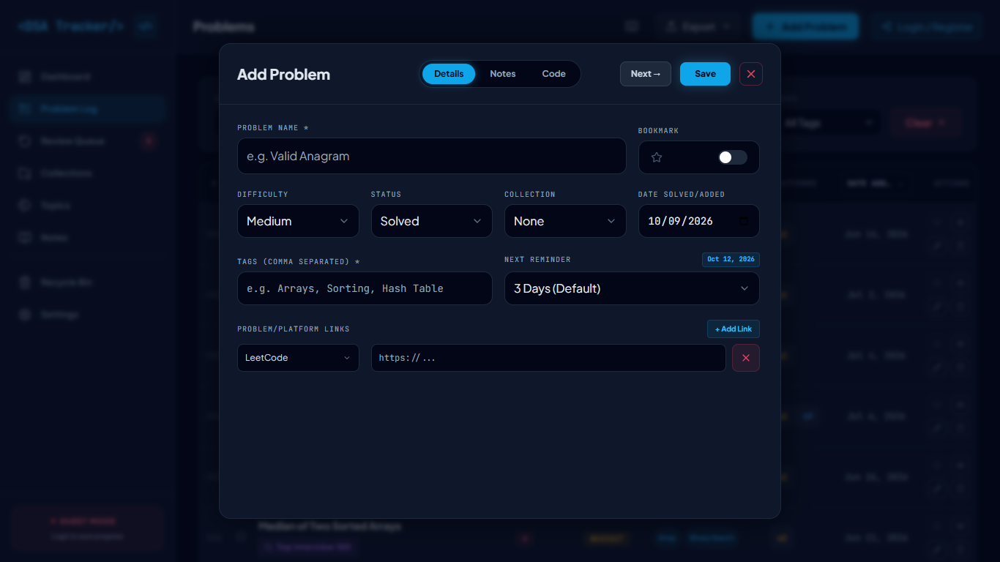
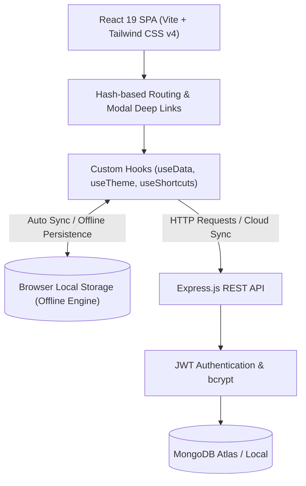

<div align="center">

# ⚡ DSA Tracker

### Master Data Structures & Algorithms with Spaced Repetition

A modern, production-grade MERN-stack dashboard designed to beat the forgetting curve. Track, review, organize, and retain your coding interview preparation with scientifically proven Spaced Repetition (SRS), 90-day consistency heatmaps, markdown notes, and curated collection lists.

[](LICENSE)
[](https://react.dev/)
[](https://vitejs.dev/)
[](https://tailwindcss.com/)
[](https://nodejs.org/)
[](https://expressjs.com/)
[](https://www.mongodb.com/)
[](CONTRIBUTING.md)

[Live Demo](#-getting-started) • [Key Features](#-core-features) • [Screenshots](#-visual-tour) • [Quickstart](#-getting-started) • [API Reference](#-api-reference)

---

</div>

## 📌 Why DSA Tracker?

Solving 500+ LeetCode problems means nothing if you forget the key pattern during an interview 3 months later. 

**DSA Tracker** transforms spontaneous coding practice into a structured, retention-first learning system. Powered by an automated **Spaced Repetition System (SRS)**, it schedules recurring review intervals (1, 3, 7, 14, 30, and 60 days) to lock algorithms permanently into your long-term memory.

---

## 📸 Visual Tour

### 🌓 Premium Theme Engine (Dark vs. Light Mode)

DSA Tracker features an accessible, high-contrast visual design with custom color schemes for both dark and light modes.

| Dark Theme | Light Theme |
| :---: | :---: |
|  |  |
| *Deep slate background with emerald accents & glow* | *Clean alabaster white with high-contrast slate typography* |

---

### 📋 Problem Log & Smart Filtering

Log questions with difficulty ratings, status tracking, collection tags, patterns, and dynamic multi-criteria date sorting.

| Problem Log (Dark) | Problem Log (Light) |
| :---: | :---: |
|  |  |

---

### 🔄 Spaced Repetition (SRS) Review Queue

Never miss a review. Problems automatically filter into **Overdue**, **Due Today**, and **Upcoming** buckets based on your retention interval.

<div align="center">
  
</div>

---

### 📚 Knowledge Base, Collections & Topics

Organize by curated roadmaps (Blind 75, NeetCode 150) and retain algorithmic insights with inline Markdown notes.

| Curated Collections | Topic Breakdown |
| :---: | :---: |
|  |  |

| Markdown Knowledge Base | Quick Add Modal |
| :---: | :---: |
|  |  |

---

## ✨ Core Features

### 🧠 Scientific Spaced Repetition (SRS)
* **Smart Intervals**: Progresses through retention stages (1 → 3 → 7 → 14 → 30 → 60 days) with each successful review.
* **Triage Buckets**: Instant categorization into **Overdue**, **Due Today**, and **Upcoming** so you know exactly what to solve first.
* **One-Click Review**: Mark reviews complete right from the queue; the system automatically pushes the next review date forward.

### 📊 Real-Time Analytics & Heatmap
* **90-Day Contribution Heatmap**: Visual GitHub-style daily practice grid tracking submission volume and unbroken consistency.
* **KPI Metrics**: Real-time counters for Total Solved, Solved Today, Due Reviews, and Problems Logged.
* **Difficulty Distribution**: Dynamic visual progress bars for Easy, Medium, and Hard problem splits.

### ⚡ Problem Management & Smart Sorting
* **Multi-Criteria Date Sorting**: Sort and view your problem list dynamically by:
  - `Date Added`
  - `Date Solved`
  - `Date Mastered`
  - `Date Last Solved`
* **Uniform & Compact Controls**: Streamlined difficulty, status, and date filters with pixel-perfect alignment.
* **Full-Text Instant Search**: Instant client-side search across titles, patterns, collections, and tags.

### 📝 Markdown Study Notes
* Write full markdown solutions, time/space complexity analysis ($O(N)$, $O(\log N)$), and trade-offs.
* Quick-view and edit notes directly from the problem table without page reloads.

### 🗂️ Curated Collections & Categorization
* Bundle problems into custom collections (e.g. *Striver's SDE Sheet*, *Blind 75*, *Dynamic Programming Masterlist*).
* Color-coded tags and custom descriptions for every collection.

### 🛡️ Dual Guest & Cloud Modes
* **Guest Mode**: Start tracking immediately out-of-the-box with instant client-side state — zero login required.
* **Cloud Sync**: Create a secure account (JWT + bcrypt) to persist and sync your preparation across all devices.
* **Profile Management**: Customize display name, handle, and password with real-time length limit validation (20 chars for name/username, 10 chars for password) and password visibility eye toggles.

### 🌐 100% Offline Persistence & Local Storage Engine
* **Zero Backend Dependency**: Track DSA problems even when the backend server or MongoDB is completely offline.
* **Automatic Local Storage Sync**: Every problem, curated list, recycled item, and heatmap activity automatically persists to browser `localStorage`.
* **Real-Time Offline Status Beacon**: An ambient, slowly blinking top-right notification banner alerts you when the backend is unreachable while confirming that all your data remains safely stored locally.
* **Static Deployment Ready**: Run as a pure standalone client on **GitHub Pages**, **Vercel**, or **Netlify**.

### 💾 Data Portability & Safety
* **Import / Export**: Backup or migrate your entire problem library anytime with one-click **JSON** or **CSV** export.
* **Recycle Bin (Trash)**: Soft-delete protection allows recovering accidentally removed problems or permanently purging them.
* **Logout Confirmation**: Interactive confirmation modal prevents accidental session terminations.

### ⌨️ Keyboard Shortcuts
* Navigate like a pro using single-key shortcuts (`N` for new problem, `D` for dashboard, `P` for problems, `?` for help modal).

---

## 🏗️ Architecture & Tech Stack



### Frontend
* **Core**: [React 19](https://react.dev/), [Vite 6](https://vitejs.dev/)
* **Styling**: [Tailwind CSS v4](https://tailwindcss.com/)
* **Icons**: [Lucide React](https://lucide.dev/)
* **Effects**: [canvas-confetti](https://www.npmjs.com/package/canvas-confetti)

### Backend
* **Runtime**: [Node.js](https://nodejs.org/) (v18+)
* **Framework**: [Express.js](https://expressjs.com/)
* **Database & ODM**: [MongoDB](https://www.mongodb.com/) with [Mongoose](https://mongoosejs.com/)
* **Security**: JSON Web Tokens (`jsonwebtoken`), password hashing (`bcryptjs`), CORS (`cors`), environment configs (`dotenv`)

---

## 🚀 Getting Started

### Prerequisites
Make sure you have the following installed:
* [Node.js](https://nodejs.org/) (v18.0.0 or higher)
* [npm](https://www.npmjs.com/) (v9.0.0 or higher)
* [MongoDB](https://www.mongodb.com/try/download/community) installed locally or a [MongoDB Atlas](https://www.mongodb.com/atlas) connection URI.

---

### Step 1: Clone the Repository
```bash
git clone https://github.com/rahulkamti11/DSA-Tracker-MERN.git
cd DSA-Tracker-MERN
```

---

### Step 2: Configure Environment Variables

#### Backend Configuration
Create a `.env` file inside the `backend/` directory:
```bash
# backend/.env
PORT=5000
MONGO_URI=mongodb://localhost:27017/dsa-tracker
JWT_SECRET=your_super_secret_jwt_random_key_here
```

#### Frontend Configuration
Create a `.env` file inside the `frontend/` directory:
```bash
# frontend/.env
VITE_API_URL=http://localhost:5000/api
```

---

### Step 3: Install Dependencies & Run

#### Option A: One-Command Root Launch (Recommended)
You can install and run both frontend and backend concurrently from the root directory:

```bash
# Install dependencies for both frontend and backend
npm run install-all

# Start both backend and frontend concurrently
npm run dev
```

#### Option B: Individual Service Launch
If you prefer running frontend and backend in separate terminal windows:

**Terminal 1 (Backend)**:
```bash
cd backend
npm install
npm run dev
# Server runs on http://localhost:5000
```

**Terminal 2 (Frontend)**:
```bash
cd frontend
npm install
npm run dev
# Vite runs on http://localhost:5173
```

Now open [http://localhost:5173](http://localhost:5173) in your browser!

---

## ⌨️ Keyboard Shortcuts

Speed up your workflow without taking your hands off the keyboard:

| Key | Action |
| :---: | :--- |
| <kbd>N</kbd> | Open **Add New Problem** modal |
| <kbd>D</kbd> | Jump to **Dashboard** |
| <kbd>P</kbd> | Jump to **Problem Log** |
| <kbd>R</kbd> | Jump to **Review Queue** |
| <kbd>C</kbd> | Jump to **Collections** |
| <kbd>T</kbd> | Jump to **Topics** |
| <kbd>K</kbd> | Jump to **Notes Knowledge Base** |
| <kbd>?</kbd> | Open **Keyboard Shortcuts** modal |
| <kbd>Esc</kbd> | Close any open modal or dialog |

---

## 🛡️ API Reference

### Authentication Endpoints
| Method | Endpoint | Description | Protected |
| :--- | :--- | :--- | :---: |
| `POST` | `/api/auth/register` | Register a new user | ❌ |
| `POST` | `/api/auth/login` | Authenticate user & issue JWT | ❌ |
| `GET` | `/api/auth/profile` | Get current user profile & heatmap | ✅ |
| `POST` | `/api/auth/activity` | Record daily submission & update streak | ✅ |

### Problems Endpoints
| Method | Endpoint | Description | Protected |
| :--- | :--- | :--- | :---: |
| `GET` | `/api/problems` | Retrieve all active problems | ✅ |
| `POST` | `/api/problems` | Create and log a new problem | ✅ |
| `PUT` | `/api/problems/:id` | Update problem details or SRS status | ✅ |
| `PUT` | `/api/problems/:id/trash` | Soft delete (move to trash) or restore | ✅ |
| `DELETE` | `/api/problems/:id` | Permanently delete a problem | ✅ |
| `DELETE` | `/api/problems/trash/empty`| Permanently purge all trashed problems | ✅ |

### Collections Endpoints
| Method | Endpoint | Description | Protected |
| :--- | :--- | :--- | :---: |
| `GET` | `/api/collections` | Retrieve all curated collections | ✅ |
| `POST` | `/api/collections` | Create a new custom collection list | ✅ |
| `DELETE` | `/api/collections/:id` | Delete a collection | ✅ |

---

## 📁 Project Directory Structure

```text
DSA-Tracker-MERN/
├── backend/                  # Node.js + Express API
│   ├── config/               # Database connection setup
│   ├── middleware/           # JWT auth verification middleware
│   ├── models/               # Mongoose schemas (User, Problem, Collection)
│   ├── routes/               # API route definitions (auth, problems, collections)
│   └── server.js             # Express entry point
├── frontend/                 # React 19 Client SPA
│   ├── src/
│   │   ├── components/       # UI components (Dashboard, ProblemList, ReviewQueue, Modals)
│   │   ├── hooks/            # Custom hooks (useData, useTheme, useShortcuts)
│   │   ├── utils/            # Helper utilities (spaced repetition math, formatters)
│   │   ├── App.jsx           # Master view container & hash router
│   │   └── main.jsx          # React DOM root
│   ├── index.html            # HTML template with dark theme background
│   └── vite.config.js        # Vite build & plugin settings
├── docs/
│   └── screenshots/          # High-resolution application screenshots
├── package.json              # Root workspace scripts (concurrent launch)
├── README.md                 # Complete project documentation
└── .gitignore                # Git ignore patterns
```

---

## 🤝 Contributing

Contributions are what make the open-source community such an amazing place to learn, inspire, and create. Any contributions you make are **greatly appreciated**!

1. Fork the Project
2. Create your Feature Branch (`git checkout -b feature/AmazingFeature`)
3. Commit your Changes (`git commit -m 'feat: add AmazingFeature'`)
4. Push to the Branch (`git push origin feature/AmazingFeature`)
5. Open a Pull Request

---

## 📄 License

Distributed under the **MIT License**. See [`LICENSE`](LICENSE) for more information.

---

<div align="center">

Crafted with ❤️ by [Rahul Kamti](https://github.com/rahulkamti11)

**Star ⭐ this repository if you find it helpful for your interview prep!**

</div>
